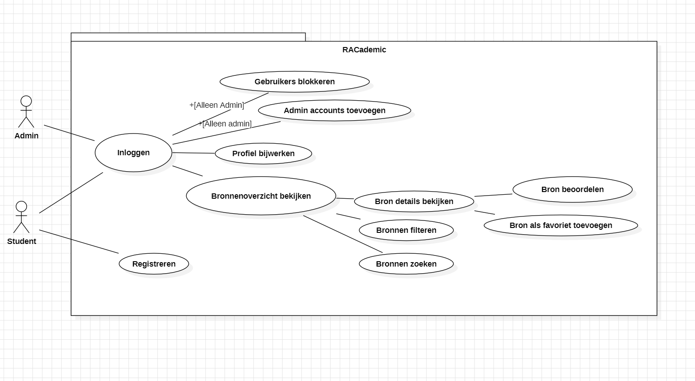

# Bronnendeling App RACademic

## Introductie

Om elkaar op weg te helpen op de RAC willen we een platform beschikbaar maken waar studenten met elkaar bronnen kunnen delen die hen geholpen hebben bij hun studie. Denk hierbij aan een goede YouTube-video, online cursus of boek die je geholpen heeft met je studie.

Hieronder vind je een user case diagram met de functionaliteiten die erin moeten zitten. Je mag ook de flow aanpassen door bijvoorbeeld al in het bronnenoverzicht bronnen te kunnen beoordelen of toe te kunnen voegen aan favorieten, zolang alle requirements en functionaliteiten maar voldaan zijn.

## Requirements

### Index en registratie

Om de veiligheid en relevantie van de app te waarborgen, zijn de volgende regels opgesteld:

- **Gebruik van de app wordt beperkt tot studenten van de Hogeschool Rotterdam**
    - Dit gebeurt door alleen registratie toe te staan met een `@hr.nl` e-mail.
    - Dit voorkomt dat externe gebruikers of bots zich aanmelden en ongerelateerde of ongewenste content plaatsen.

- **Om content van de app te bekijken, moet een gebruiker ingelogd zijn**
    - Dit zorgt ervoor dat de gedeelde bronnen enkel beschikbaar zijn voor geverifieerde studenten en niet voor het brede internet.

- **Administrator-accounts kunnen e-mails blokkeren om misbruik tegen te gaan**
    - Dit mechanisme maakt het mogelijk om misbruik te verminderen, zoals het plaatsen van irrelevante of schadelijke content.

- **Geblokkeerde e-mails kunnen niet opnieuw worden gebruikt bij registratie**
    - Dit voorkomt dat een gebruiker die misbruik maakt van de app simpelweg een nieuw account aanmaakt met hetzelfde e-mailadres.

- **Administrator-accounts kunnen andere administrator-accounts aanmaken**
    - Ook deze accounts moeten een `@hr.nl` e-mail bevatten om de controle binnen de organisatie te houden.
    - Dit is belangrijk zodat meerdere verantwoordelijke personen beheerrechten kunnen krijgen en niet alles van één beheerder afhankelijk is.

### Account/profiel

- **Een gebruiker moet zijn displaynaam kunnen aanpassen**
    - Standaard is dit het studentnummer uit zijn e-mail.
    - Dit zorgt voor privacy (niet iedereen wil zijn studentnummer publiek tonen) en personalisatie (gebruikers kunnen hun naam of een herkenbare alias instellen).

- **Een gebruiker moet zijn wachtwoord kunnen aanpassen**
    - Dit biedt gebruikers controle over hun accountbeveiliging en maakt het mogelijk een nieuw wachtwoord in te stellen bij een mogelijke beveiligingsdreiging.

### Bronnendeling

Om de kernfunctionaliteit van de app te realiseren, moeten gebruikers eenvoudig bronnen kunnen vinden en delen.

- **Gebruikers moeten bronnen kunnen delen**
    - Dit maakt het mogelijk om nuttige studiematerialen te verspreiden en medestudenten te helpen.

- **Gebruikers moeten gedeelde bronnen kunnen bekijken**
    - Dit is de kernfunctionaliteit van de app: toegang krijgen tot relevante en nuttige bronnen voor hun studie.

- **Gebruikers moeten gedeelde bronnen kunnen beoordelen**
    - Dit helpt bij het filteren van waardevolle bronnen en verhoogt de kwaliteit van de gedeelde content.
    - Bijvoorbeeld: een bron met veel positieve beoordelingen wordt sneller herkend als nuttig.

- **Gebruikers moeten kunnen zoeken en filteren binnen gedeelde bronnen**
    - Zonder een zoek- en filtersysteem wordt de app snel onoverzichtelijk.
    - Dit maakt het makkelijker om snel relevante bronnen te vinden, bijvoorbeeld per vak, onderwerp of moeilijkheidsgraad.

- **Gebruikers moeten gedeelde bronnen kunnen toevoegen aan favorieten**
    - Hiermee kunnen gebruikers eenvoudig terugkomen naar bronnen die zij later willen bekijken of hergebruiken.

- **Bronnen kunnen verschillende types hebben**
    - Denk aan boeken, artikelen, YouTube-video’s en online cursussen.
    - Voor elk type bron moet een geschikte presentatievorm worden gekozen, bijvoorbeeld:
        - Een boek met een afbeelding van de cover, ISBN en korte samenvatting.
        - Een video met een thumbnail en de duur van de video.

- **Denk na over mechanismes om eenvoudig te zoeken en filteren**
    - Bijvoorbeeld door middel van **tags** of **categorieën**, zodat gebruikers gerichter kunnen zoeken binnen een groot aantal bronnen.

## Mogelijke extra’s

Deze extra functies kunnen de gebruikservaring verbeteren en het platform aantrekkelijker maken:

- **Gamification**
    - Badges op basis van aantal gedeelde bronnen, aantal likes/favorieten op gedeelde bronnen, en leaderboards.
    - Dit stimuleert gebruikers om actiever deel te nemen en bronnen te delen.

- **Notificaties**
    - Feedback als iemand je gedeelde content liket/favoriet maakt of als er nieuwe content is.
    - Dit vergroot de betrokkenheid en houdt gebruikers op de hoogte van relevante updates.

- **Volgsysteem**
    - Gebruikers kunnen categorieën, tags of medestudenten volgen en zo notificaties ontvangen bij nieuwe content.
    - Dit zorgt ervoor dat studenten sneller de voor hen meest relevante bronnen kunnen vinden.

## Technische requirements

In het kader van de leerdoelen van deze periode zijn de volgende technische eisen gesteld:

- **De frontend van de applicatie moet gebruik maken van React Native**
    - Dit zorgt ervoor dat de app zowel op Android als iOS gebruikt kan worden zonder aparte codebases.
    - Hierdoor is de app toegankelijk voor een brede groep studenten.

- **Het product moet werken als complete website maar ook als mobiele app**
    - Studenten kunnen de app zowel op hun laptop als op hun telefoon gebruiken.
    - Dit verhoogt de toegankelijkheid en flexibiliteit.

- **De backend moet opgezet zijn in Docker**
    - Dit zorgt voor een gestandaardiseerde en eenvoudig te deployen backend.
    - Docker maakt het eenvoudiger om de app in verschillende omgevingen (bijv. lokaal en in de cloud) consistent te draaien.

- **Volledige documentatie van het project**
    - Hierin moet komen te staan:
         - Hoe je de app kunt draaien
         - Hoe je de website kan draaien
         - Welke features er beschikbaar zijn
         - Bronnenvermelding van gebruikte code of assets
         - Al het andere wat jullie belangrijk achten te melden
    - Dit zorgt ervoor dat docenten beter kunnen nakijken en toekomstige ontwikkelaars snel aan de slag kunnen met het project.

## Potentiële rewards

Over de ingeleverde projecten worden de volgende prijzen uitgereikt:

- **Beste UX** (gebruikerservaring)
- **Beste accessibility** (toegankelijkheid)
- **Beste Back-end** (technische implementatie en efficiëntie)
- **Beste Security** (beveiliging en gegevensbescherming)
- **Beste Documentatie** (duidelijke en gestructureerde uitleg van de code en architectuur)  
